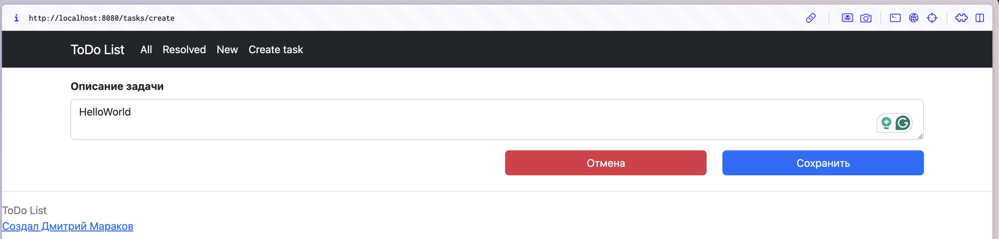
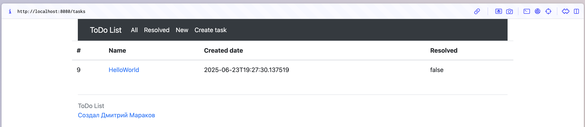
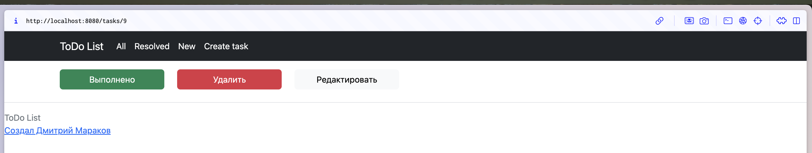
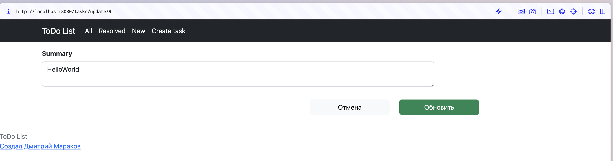

## Project name

job4j_todo

## Description

A simple todo sheet where you can create tasks and execute them. A task has three statuses: ‘All’, ‘Completed’, ‘New’.
Tasks can be executed, edited and deleted.

## Technology stack

Spring boot, Thymeleaf, Bootstrap, Hibernate, PostgreSql

## Environment

Java 17, Maven 3.9, PostgreSQL 14

## How to start project

Just use main class

## Screenshoots:

### Create page:

### Main page:

### Edit page:

### Edit summary page:
